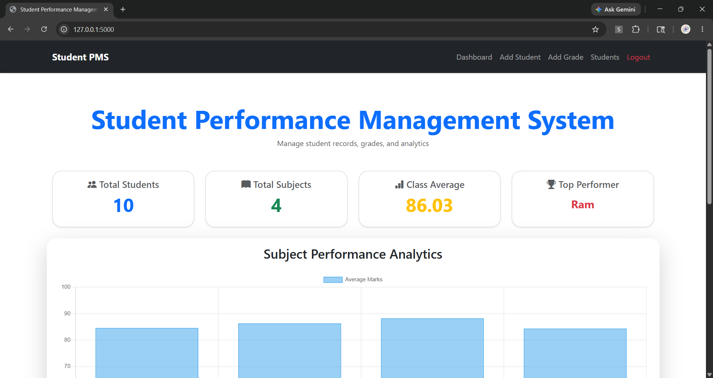
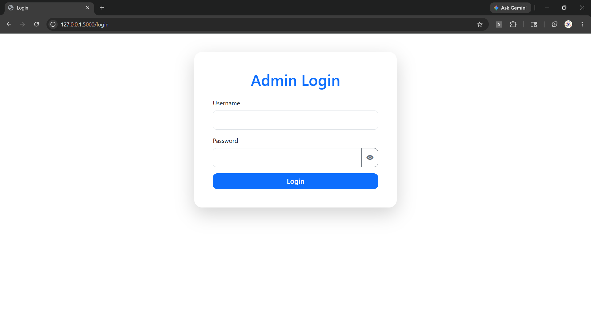
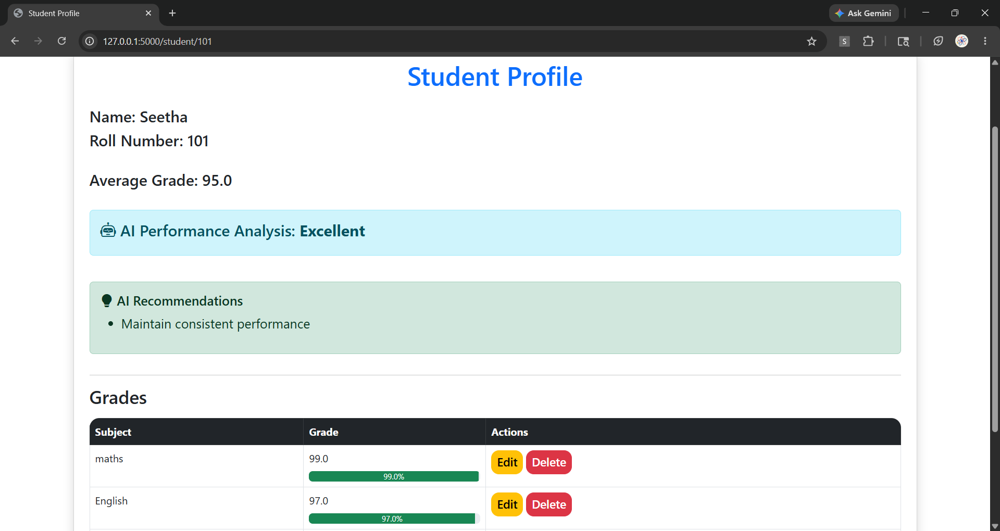
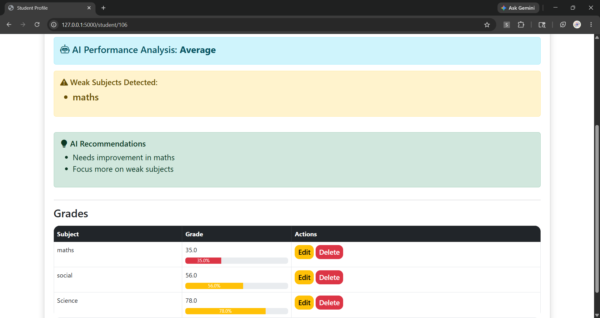

# 🎓 AI-Powered Student Performance Management System

A full-stack AI-powered web application for managing student records, analyzing academic performance, detecting weak subjects, and generating intelligent performance insights using Flask, SQLite, and Machine Learning.

# 🚀 Features

## 👨‍🎓 Student Management
- Add Students
- Delete Students
- Search Students
- View Student Profiles

## 📚 Grade Management
- Add Grades
- Edit Grades
- Delete Subjects
- Calculate Average Grades

## 📊 Analytics Dashboard
- Subject Performance Charts
- Class Average Calculation
- Top Performer Detection
- Student Performance Visualization

## 🤖 AI Features
- AI-Based Performance Analysis
- Weak Subject Detection
- Intelligent Academic Insights
- Performance Risk Prediction

## 🔐 Authentication
- Admin Login System
- Session Management
- Logout Functionality

---

# 🛠️ Technologies Used

## Frontend
- HTML5
- CSS3
- Bootstrap 5
- Chart.js

## Backend
- Python
- Flask

## Database
- SQLite

## AI / Machine Learning
- Scikit-learn
- Pandas
- NumPy

---

# 📂 Project Structure

```bash
AI-Student-Performance-Management-System/
│
├── static/
│   └── style.css
│
├── templates/
│   ├── index.html
│   ├── login.html
│   ├── add_student.html
│   ├── add_grade.html
│   ├── student_profile.html
│   ├── view_students.html
│   ├── edit_grade.html
│   └── update_grade.html
│
├── app.py
├── database.py
├── tracker.py
├── student.py
├── students.db
└── README.md
```

---

# ⚙️ Installation & Setup

## 1️⃣ Clone Repository

```bash
git clone https://github.com/sushma1105/AI-Student-Performance-Management-System.git
```

## 2️⃣ Open Project Folder

```bash
cd AI-Student-Performance-Management-System
---

## 3️⃣ Install Dependencies

```bash
pip install flask pandas numpy scikit-learn
```

## 4️⃣ Run Application

```bash
python app.py
```

# 🌐 Open in Browser

```text
http://127.0.0.1:5000
```

# 🔑 Default Login Credentials

| Username | Password |
|----------|----------|
| admin | admin123 |

---

# 📸 Screenshots

## Dashboard


## Login


## Student Profile


## AI Analysis


---

# 🎯 Future Improvements

- Cloud Deployment
- Email Notifications
- Export Reports as PDF
- Advanced AI Predictions
- Multi-Admin Support
- Student Attendance Tracking
---

# 👩‍💻 Developed By
Yesaswi Sushma Peela

---

# ⭐ If you like this project, give it a star on GitHub!
