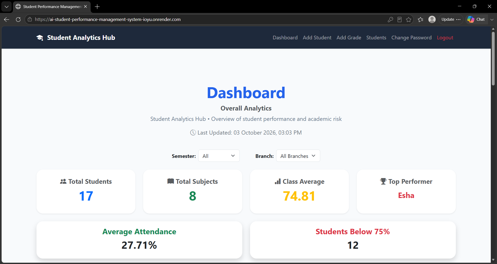
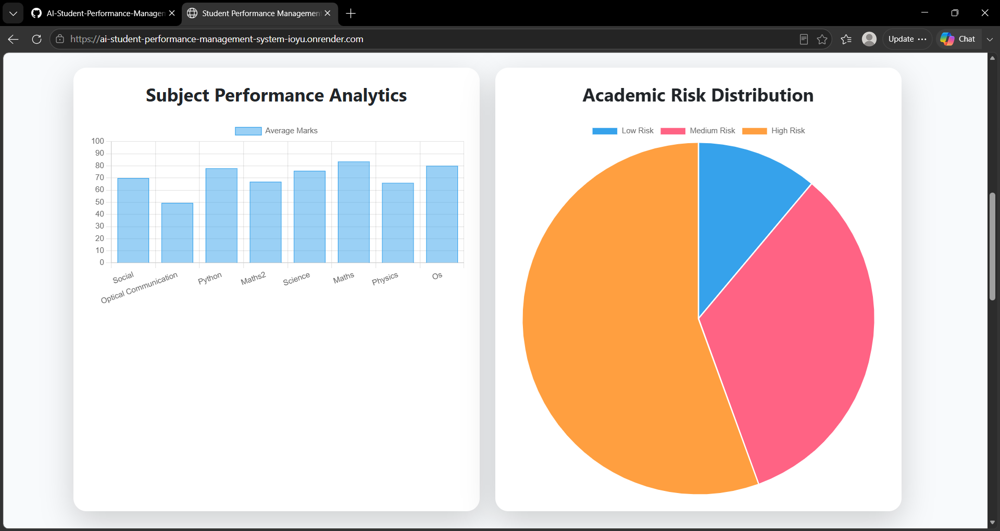
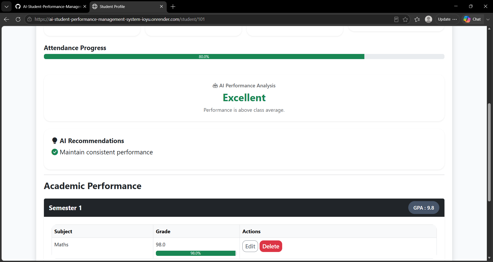
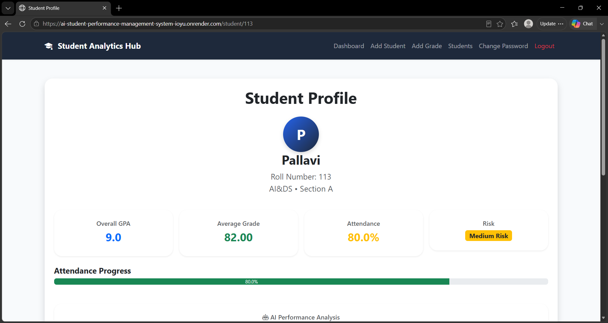

# 🎓 AI-Powered Student Performance Management System

A full-stack web application for managing student academic records, analyzing performance, tracking attendance, and providing AI-based academic insights.

The system supports student management, semester-wise grade management, interactive analytics, academic risk prediction, activity tracking, and downloadable student report cards.

## 🚀 Live Demo

**Deployed Application:**  
https://ai-student-performance-management-system-ioyu.onrender.com

> The application is deployed on Render and uses PostgreSQL through Neon for persistent database storage.

---

## ✨ Features

### 👨‍🎓 Student Management

- Add and manage student records
- Search students by roll number
- View detailed student profiles
- Manage branch and section information
- Delete student records with confirmation

### 📚 Grade Management

- Add, edit, and delete grades
- Semester-wise grade management
- Grade validation from 0–100
- Prevent duplicate subjects within the same semester
- Automatic performance calculations
- Semester-wise academic records

### 📊 Analytics Dashboard

- Class average calculation
- Top performer identification
- Subject-wise performance analysis
- Student performance visualization
- Attendance tracking
- Semester and branch filtering
- Academic risk statistics
- Interactive charts

### 🤖 AI & Machine Learning

- AI-based academic performance analysis
- Weak subject identification
- Academic recommendations
- Academic performance risk prediction
- Machine learning model integration using Scikit-learn
- Student performance data analysis using Pandas and NumPy

### 📄 Student Report Cards

- Generate student report cards
- Download report cards as PDF
- Include academic performance information in generated reports

### 🔐 Authentication & Security

- Admin authentication
- Student authentication
- Session-based access control
- Logout protection
- Password visibility toggle
- Database credentials managed through environment variables

### 📝 Activity Tracking

- Record important system activities
- Track activity timestamps
- Admin activity monitoring

### 🎨 User Experience

- Responsive interface
- Loading indicators and spinners
- Success and error messages
- Empty-state messages
- Delete confirmations
- Mobile-friendly layouts
- Interactive charts

---

## 🔑 Demo Login

### Admin

- **Username:** `admin`
- **Password:** `admin123`

> These credentials are provided for demonstration purposes only. Do not use them for production or sensitive data.

---

## 📸 Screenshots

### 📊 Dashboard

The dashboard provides an overview of student performance, attendance, class average, top performer, and academic risk.



### 📈 Performance & Academic Risk Analytics

Interactive charts display subject-wise performance and academic risk distribution.



### 🤖 AI Performance Analysis

The system provides AI-based academic performance analysis and recommendations.



### 👨‍🎓 Student Profile

The student profile includes attendance, AI insights, semester-wise academic performance, GPA, and grades.



---

## 🛠️ Technology Stack

### Frontend

- HTML5
- CSS3
- Bootstrap 5
- JavaScript
- Chart.js

### Backend

- Python
- Flask
- Flask-SQLAlchemy

### Database

- PostgreSQL
- Neon PostgreSQL
- psycopg
- psycopg2

### Machine Learning & Data Processing

- Scikit-learn
- Pandas
- NumPy
- Joblib
- Matplotlib

### PDF Generation

- ReportLab

### Deployment

- Render
- Gunicorn

---

## 🏗️ Project Architecture

```text
User
 │
 ▼
Frontend
HTML / CSS / JavaScript / Bootstrap / Chart.js
 │
 ▼
Flask Application
 │
 ├── Authentication
 ├── Student Management
 ├── Grade Management
 ├── Attendance
 ├── Analytics
 ├── AI Performance Analysis
 ├── Academic Risk Prediction
 ├── Activity Tracking
 └── PDF Report Generation
 │
 ▼
SQLAlchemy
 │
 ▼
Neon PostgreSQL
```

---

## 📂 Project Structure

```text
AI-Student-Performance-Management-System/
│
├── Screenshots/
│   ├── Dashboard.png
│   ├── analytics.png
│   ├── AI_Performance_analysis.png
│   └── Student_Profile.png
│
├── static/
│   └── style.css
│
├── templates/
│   ├── index.html
│   ├── login.html
│   ├── add_student.html
│   ├── add_grade.html
│   ├── student_profile.html
│   ├── view_students.html
│   ├── edit_grade.html
│   └── ...
│
├── academic_risk_model.pkl
├── app.py
├── database.py
├── models.py
├── main.py
├── student.py
├── tracker.py
├── requirements.txt
├── Procfile
├── .gitignore
└── README.md
```

---

## ⚙️ Local Installation & Setup

### 1. Clone the Repository

```bash
git clone https://github.com/sushma1105/AI-Student-Performance-Management-System.git
```

### 2. Open the Project

```bash
cd AI-Student-Performance-Management-System
```

### 3. Create a Virtual Environment

```bash
python -m venv venv
```

Activate it on Windows:

```bash
venv\Scripts\activate
```

### 4. Install Dependencies

```bash
pip install -r requirements.txt
```

### 5. Configure the Database

The application uses PostgreSQL through the `DATABASE_URL` environment variable.

On Windows PowerShell:

```powershell
$env:DATABASE_URL="YOUR_POSTGRESQL_CONNECTION_STRING"
```

> Do not commit database credentials or passwords to GitHub.

### 6. Run the Application

```bash
python app.py
```

### 7. Open in Browser

```text
http://127.0.0.1:5000
```

---

## 🌐 Deployment

The application is deployed using **Render**.

### Build Command

```bash
pip install -r requirements.txt
```

### Start Command

```bash
gunicorn app:app --bind 0.0.0.0:$PORT
```

### Environment Variable

The production database connection is configured using:

```text
DATABASE_URL
```

Database credentials are stored as environment variables rather than hard-coded in the application source code.

---

## 🗄️ Database

The application uses **PostgreSQL with Neon**.

The database stores:

- Student records
- Student authentication information
- Grades
- Semester information
- Attendance
- Admin information
- Activity records

Grades use a uniqueness constraint based on:

```text
student + subject + semester
```

This allows the same subject to exist for different semesters while preventing duplicate entries within the same semester.

---

## 🧠 Machine Learning Model

The project includes an academic risk prediction model:

```text
academic_risk_model.pkl
```

The model is integrated into the Flask application using Joblib and Scikit-learn.

The application uses student academic information to provide performance and academic-risk insights.

---

## 🔒 Security Notes

- Database credentials are stored using environment variables.
- `.env` files are excluded through `.gitignore`.
- Production database credentials should never be committed to GitHub.
- The credentials listed above are demonstration credentials for the public demo application only.

---

## 🔮 Future Enhancements

Possible future improvements include:

- Email notifications for students and administrators
- Automated model retraining pipeline
- More advanced academic prediction models
- Automated testing and CI/CD
- More granular role-based permissions
- Additional analytics and reporting features

---

## 👩‍💻 Developed By

**Yesaswi Sushma Peela**

B.Tech — Artificial Intelligence & Data Science

---

## ⭐ Project

If you find this project useful, consider giving the repository a ⭐ on GitHub.
